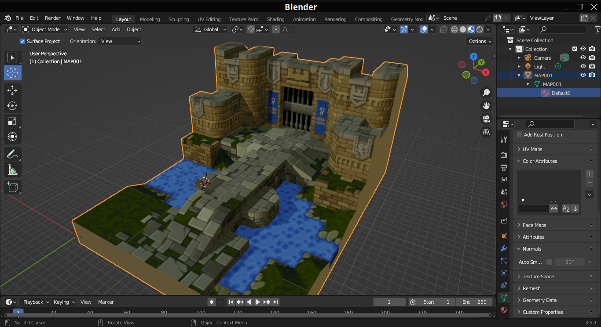
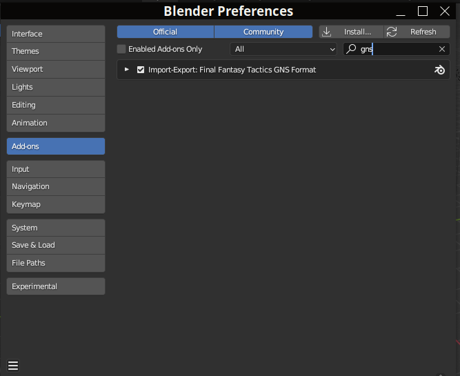
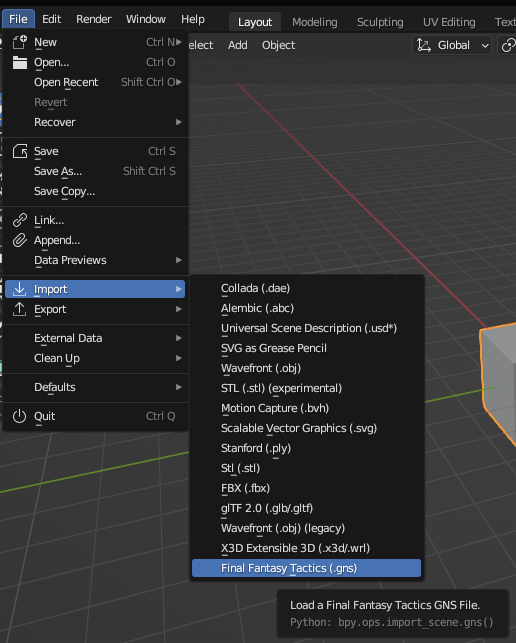

# Final Fantasy Tactics Blender Importer

 
 

This is modified heavily from the JustinMarshall98 Ganesha Python version, which itself was modified from the Gomtuu Ganesha Python version.
It was convenient that Blender plugins are written in Python.
It's also borrowing a lot of wisdom from the C# port, GaneshaDx.

## Installing

To get it working, copy the folder structure into your Blender user path.
If you don't know where that is then follow this link:

https://docs.blender.org/manual/en/latest/advanced/blender_directory_layout.html

Once it is copied, next go to Edit -> Preferences -> Add-Ons, then scroll down or filter by the word 'GNS', and you should see the plug-in:

Click the checkbox and you should now find a new option under File -> Import:

## Progress

All combinations of map, day/night, and weather are imported as collections.

Each collection contains a 3D mesh with textured and untextured polygons.

The 3D mesh contains a material per palette.  These materials are made of a image texture node of the 4-bpp indexed color image, 
which connects into an image texture node of the 16-pixels-wide RGBA palette texture,
which finally connects into the BSDF shader.

Each collection also contains a terrain mesh.

The terrain mesh faces are imported with custom per-face attributes assigned to them.
These custom attributes can be accessed from 'Geometry Nodes' -> 'Face' -> scroll right in list of face attributes to see all the extra custom ones.

Each collection also contains the 3 directional lights' colors are imported as sun lights.
The directions are still meh.

Each collection also contains a light representing the map ambient light.  It's a sun light too for now, but I know sun light is directional, idk where to set ambient-light in materials in blender... 

The background is imported as a sphere around the map, with gradient material.

TODO:
- animated meshes
- animated palettes
- animated ... ? lights? idk.
- ambient as real ambient / material property, not as a sun light.
- background sphere needs to have its normals flipped, and be smooth shaded.
- preserve quads? right now it triangulates everything, but GNS supports tris and quads.
- light directions as blender-sun-light rotations, and just figuring out blender's transform system.
- ... how to organize all transforms?  should I work in mesh vertex coords so blocks are 28x24x28?  should I work in tile coords?  where to put the transforms?  z-up vs y-up?  matrix local vs matrix global vs location rotation euler vs scale...
- should terrain custom face attributes be integers or strings?  would be nice to set them to dropdowns for selecting enumerations.
- if I'm writing a plugin for blender IO, why not also write a plugin for face-picking that pops up editing the different custom-face attributes?
- make use of global-scale argument, which I'm not using.  or should I use the units feature in Blender?  how does that work?
- likewise, global transform is flipping y-up to z-up ... is there a config for this in Blender?
- exporting.

## Sources:

- https://github.com/JustinMarshall98/Ganesha
- https://github.com/Garmichael/GaneshaDx
